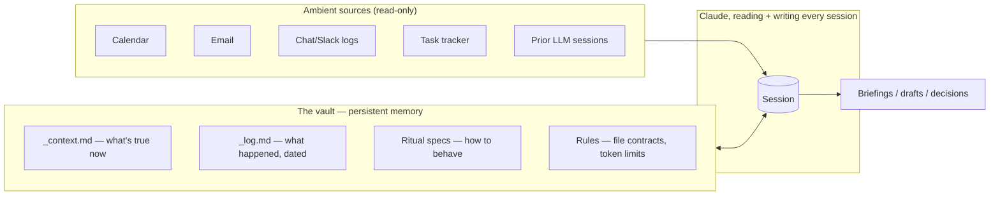

# ContextOS

**A persistent-memory system for working with Claude (or any LLM) across sessions — designed, run, and iterated on daily for over three months before being distilled into this template.**

ContextOS is a plain-text vault (built for Obsidian, but the format is tool-agnostic) plus a set of rules and behavior specs that turn a stateless chat assistant into something closer to a chief of staff who's been in the room for months. It is the outside memory an LLM doesn't have: a place for "who reports to whom," "what did we decide and why," "what's still open," and "what does this acronym mean here" to live between sessions, so none of it has to be re-explained.

This repo is not a wrapper, a plugin, or an API. It's an information-architecture pattern — file types, folder shapes, and behavior contracts — that happens to run on top of Claude's filesystem access. The interesting part isn't the AI. It's the system around it.

## The thesis

> The bottleneck in working with AI was never the model. It's context.

Most people use an LLM like a search bar — ask, get an answer, close the tab, lose everything. That's fine for trivia. It's a waste for anyone doing real ongoing work, because it treats an increasingly capable collaborator like a vending machine instead of a colleague. Automation tools (agents, scheduled tasks, skills) don't fix this — they let you run a broken process exactly as fast as a good one. If what's being automated doesn't actually know the org chart, you just get wrong answers faster and on a schedule.

ContextOS is the bet that if the infrastructure exists to carry real context forward, the ceiling on what an LLM can do isn't the model — it's the discipline of the system around it.

## What's in this repo

| Doc | Covers |
|---|---|
| [`docs/01-manifesto.md`](docs/01-manifesto.md) | The problem, the philosophy, the non-negotiable design principles, what it costs |
| [`docs/02-architecture.md`](docs/02-architecture.md) | The vault structure, the file-type contract that holds memory, domains vs. projects, closed vocabularies, system diagrams |
| [`docs/03-rituals.md`](docs/03-rituals.md) | Full behavior specs for the 11 rituals that drive the system — triggers, inputs, steps, outputs |
| [`docs/04-setup-guide.md`](docs/04-setup-guide.md) | Step-by-step onboarding: tools, vault, Claude configuration, first session, customization |
| [`docs/05-lessons-learned.md`](docs/05-lessons-learned.md) | The failure modes that actually happened, the fixes that came out of them, and what's still unsolved — a real build history, not a highlight reel |
| [`template/`](template/) | The actual vault skeleton — copy it into Obsidian and it's ready to configure |

## The core idea, in one diagram

Every session, Claude reads the architecture map, loads *only* the context relevant to the task at hand, and writes back before the session ends. The vault holds state. The conversation is where reasoning happens. If it matters, it gets written down — and it's written down in a shape that stays cheap to read next time.

## Why this matters for token efficiency

The system is built around one rule most memory systems ignore: **every file an LLM reads costs tokens, so load only what's needed.** That shows up structurally, not just as a guideline:

- **`_context.md` vs. `_log.md`** — current state is always a single, bounded read; history is append-only and separate, so "what's true now" never requires reconstructing it from a timeline.
- **Lazy-loading by domain** — a session about one work area loads that area's context file, not all of them. A daily briefing is the one exception, and even then it's the lightweight `_index.md` files, not the full context.
- **Date-filtered ambient sources** — external logs (chat exports, ticket exports) are always read within an explicit date window, never in full.
- **A weekly distillation, not continuous accumulation** — the biggest token-bloat source in production wasn't inefficient loading, it was context files that kept every historical detail instead of being pruned into a separate log. Fixing *that* mattered more than any read-optimization.

See [`docs/05-lessons-learned.md`](docs/05-lessons-learned.md) for how that lesson was actually learned — it wasn't designed in from day one, it came from watching the system fail.

## Quickstart

1. Read [`docs/01-manifesto.md`](docs/01-manifesto.md) for the *why*.
2. Read [`docs/02-architecture.md`](docs/02-architecture.md) for the *what*.
3. Copy [`template/`](template/) into a new Obsidian vault and follow [`docs/04-setup-guide.md`](docs/04-setup-guide.md).

## A note on provenance

This template is a genericized distillation of a system built and run daily for personal use in a real PMM (product marketing) role. Names, employers, org charts, and business-specific figures have been scrubbed or replaced with illustrative placeholders — the folder structure, the rules, the ritual specs, and the failure stories are real.
