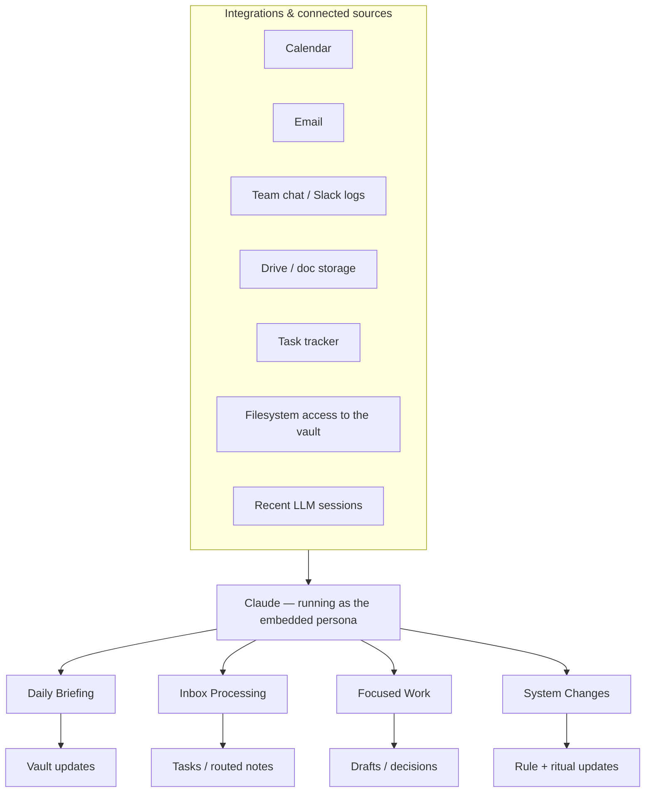
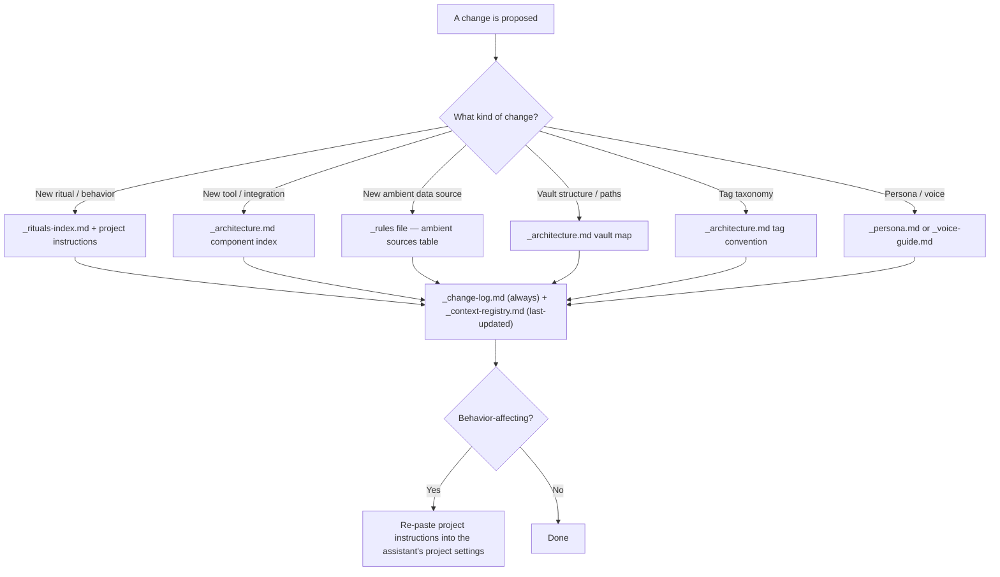

# ContextOS — Architecture & Vault Structure

## What ContextOS Is For

An LLM chat assistant has no memory between sessions — every conversation starts from zero unless something outside the chat carries context forward. ContextOS is that outside memory: a plain-text vault the assistant reads and writes every session via filesystem access, so it can function like a chief of staff who's been in the room for months, not a fresh hire every morning. Everything below is in service of that one goal: make context survive the gap between sessions, cheaply, without becoming stale or contradictory.

## Core Design Principles

- **Vault as memory, chat as compute.** The vault holds state; the conversation is where reasoning happens. If it matters, it gets written down.
- **Separate "what's true now" from "what happened."** The `_context.md` vs `_log.md` split. Current state must be readable in one pass; history must be reconstructable without polluting it.
- **Domains vs. Projects are different shapes of memory.** Test: does this have a deadline and a deliverable? → Project. Is it ongoing subject knowledge? → Domain. Filing something in the wrong one is the most common structural error.
- **A persona is a behavioral contract, not decoration.** Tone rules exist so output is consistently useful under time pressure.
- **Closed vocabularies over free-form tagging.** An open tagging system drifts within weeks. A closed list forces a propose-then-use step for anything new.
- **Rituals are behavior specs, not conversation starters.** A numbered procedure loaded fresh from disk every time — not improvised.
- **The system documents its own changes.** Any behavior-changing decision gets written to the change log in the same session it happens.

## Diagram 1 — System Overview



## Diagram 2 — Data Inputs & Integrations

Several parallel lanes feed one sink:

- **Team chat** — relevant channels, plus a personal channel/mentions feed
- **Automation** — a lightweight export pipeline (e.g. chat → spreadsheet) so logs are queryable without a live API call every time
- **Issue tracker** — feature/work tickets, exported and date-filtered
- **Productivity suite** — email, calendar, document storage
- **Task tracker / prior sessions** — whatever system of record is in use, plus the assistant's own chat history

Data stores stay simple: exported logs as flat files or spreadsheets, always **date-filtered, subject-lines-only where possible, and on-demand** — never a live full-history pull. All of it funnels into one sink: **the assistant, across all its processing modes.**

## Diagram 3 — Vault Structure

```
Daily/
  Notes.md            ← unrouted daily capture buffer
  Tasks.md             ← the single task tier
Domains/
  [domain-name]/
    _index.md          ← human dashboard
    reference/          ← stable background docs + external links
    working-docs/       ← drafts before publishing elsewhere
Projects/
  _projects-index.md   ← roll-up
  [project-name]/_index.md  ← goal, deliverables, stakeholders, log
  Complete/             ← shipped projects move here
Bases/                  ← database-style UI views (Obsidian Bases), not tied to a project
Reference/               ← cross-domain initiatives, each with _index.md
Links/                   ← saved web content, tagged
Scratch Pad/             ← thinking in progress, not yet filed
z_dev/                   ← system-building workspace — NEVER part of the shareable template
  backlog/                ← refactor plans, QA reports, design decisions
z_contextos/
  system/                 ← _architecture.md, _context-registry.md, _change-log.md
  rules/                  ← _rules-*.md, one per concern
  rituals/                ← _rituals-index.md + 11 ritual files
  reference/               ← _persona.md, _voice-guide.md, shared ops layer, style guides
  templates/               ← blank starting points for every generated file type
  project-instructions/    ← the one file always loaded into the assistant's project config
  x_archive/                ← soft-deleted files, never hard-deleted
  _data/
    Daily-Journal/
    Weekly-Journals/
    Meeting-Notes/
    People/
    Domains/[domain]/_context.md + _log.md
```

**Why the split** between `Domains/[x]/_index.md` (human dashboard) and `z_contextos/_data/Domains/[x]/_context.md` (machine-facing, rewritten wholesale on update): keeping them physically separate stopped a real failure mode — when both lived under one tree, duplicate log files got created in the wrong place and went stale. Rule that came out of it: **exactly one `_log.md` per domain, always under `z_contextos/_data/`.**

## The Three File Types That Hold Memory

| File | Rule | Failure mode if broken |
|---|---|---|
| `_context.md` | Current state only. Replace stale sections, never append below them. | Turns into an unbounded log; nobody can tell what's true now without reading the whole history. |
| `_log.md` | Append-only. New entries at the top, dated. Never edit past entries. | Allowing edits loses the audit trail that explains why current state is what it is. |
| `_index.md` | Human dashboard. The assistant reads it, but `_context.md` wins on any conflict. | If treated as equally authoritative, they drift apart silently — this happened for months in production. |

## Domains vs. Projects

A **Domain** is ongoing subject-matter memory — what's true about an area, and how it's changed. No end state. A **Project** is work with a start, end, and deliverable, usually touching more than one domain.

**Test:** *if it spans multiple domains and has a deadline and a deliverable, it's a Project; if it's ongoing subject-matter knowledge with no end date, it's a Domain.*

When a project ships: durable knowledge moves into the owning domain's `_context.md`, status is set terminal, and the folder moves to `Projects/Complete/`.

## Closed Vocabularies

Three places deliberately use a fixed, small list instead of free text:

- **Tags** — namespaced, closed taxonomy (`domain/*`, `type/*`, `org/*`, `system/*`, `status/*`). New tags require a proposal-and-approval step, logged when added.
- **Project status** — closed set: `active`, `at-risk`, `not-started`, `shipped`, `parked`. "At-risk" means a deadline has been missed or demonstrably will be — not "this feels urgent."
- **Task tiers** — deliberately collapsed to one. An earlier version ran two tiers and the second quietly stopped being referenced. Lesson: a task system nobody opens isn't a lightweight backup, it's dead weight.

## Context Maintenance — the central failure mode, and the fix

**The naive model:** update the relevant context file continuously, in every session, whenever something relevant comes up; audit occasionally to catch drift.

**Why it failed silently:** an in-session update step that produces no visible artifact is invisible when skipped. In production, two of six domains got zero updates for roughly three months across ~50 sessions, while an adjacent daily-journal habit ran at nearly 100% — because the journal produces something visibly written, and the context update didn't. **A step with no visible output gets silently skipped, no matter how many times it's marked non-negotiable.**

**The fix:** the primary maintenance mechanism moved to the End-of-Week ritual — a weekly distillation that reads the week's journals and meeting notes and produces a mandatory, visible report naming *every* domain, including the no-change ones ("Context written this week"). In-session updates still happen opportunistically — right after a transcript is processed, or when new information directly contradicts existing context — but the system no longer depends on them. The Morning ritual surfaces days-since-update per domain daily as a standing alarm — the alarm is not the fix, the weekly ritual is.

**The principle:** a deliberate "nothing changed this week" is a valid, healthy output. A silent absence of any output is the failure state.

(This is the single most important lesson in the whole system. Full incident writeup: [`05-lessons-learned.md`](05-lessons-learned.md).)

## Document Routing

- **Shareable deliverable** (leaves the system, goes to someone outside the workflow) → formal styled output (e.g. `.docx` via a style guide), uploaded to shared storage, presented — never raw HTML.
- **Working/scratch doc** (thinking in progress) → stays plain markdown, filed under the owning project if it has one, else the domain's working-docs, else Scratch Pad.

## How the System Changes Itself

1. Document a new workflow behavior in the same session it's introduced — not as a follow-up task.
2. Know which files a given change type touches (structure change → architecture map; new ritual → ritual index + ritual file + bootstrap doc; tagging change → taxonomy + rules file) and update all of them together.
3. Log every change with a dated entry explaining *what* changed and *why* — the "why" is what lets a future rebuild avoid re-making a mistake already made once.
4. If the change affects future-session behavior, the project-instructions file needs to be re-pasted into the assistant's project settings — a change-log entry alone doesn't change live behavior.

## Diagram 5 — System Change Flow



## Rebuild Checklist (if starting from nothing)

1. Vault skeleton — the folder structure above, empty.
2. Bootstrap/project-instructions document — the one file that's always loaded.
3. Architecture map (`_architecture.md`) — vault map, domain list, tag taxonomy.
4. Domain skeletons — one folder per subject area, each with empty `_context.md`, `_log.md`.
5. Three rules files that matter most on day one: context-file rules, tagging rules, token/loading-efficiency rules.
6. Two rituals before any others: Morning (orientation) and Session Wrap (close-out).
7. The weekly context-distillation ritual (End of Week) — build this in from day one rather than starting with continuous in-session updates as the only mechanism.
8. Persona document with explicit "too stiff / too casual / right" calibration examples, not just adjectives.
9. Change log — entry #1 is "system created," never skip logging a behavior-affecting change after that.
