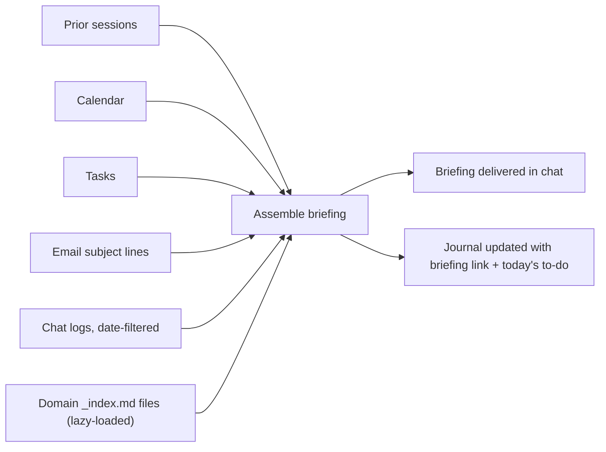

# ContextOS — Rituals Reference

Rituals are behavior specs, not conversation starters — each is a numbered procedure loaded fresh from disk every time it runs, never improvised from memory. The full text of each ritual file lives in [`template/z_workos/rituals/`](../template/z_workos/rituals/); this page is the reference index plus the two cross-cutting flow diagrams.

## Diagram 4 — Daily Briefing Flow

**Scan order (last 1 work day unless noted):**

1. Prior assistant sessions (recent-chats tool)
2. Calendar — today's meetings
3. Task tracker — open tasks
4. Email — subject lines + senders only
5. Team-chat logs — date-filtered
6. Domain `_index.md` files — all active domains, lazy-loaded

**Briefing contents:** rollover items, today's meetings + prep flags, task table (overdue flagged), email signals (1-2 bullets if material), flags (2-4 bullets), chat signals (1-3 bullets if material), domain pulse (1 line per active domain).

## Diagram 5 — System Change Flow

See [`02-architecture.md`](02-architecture.md#diagram-5--system-change-flow) — identical content lives in both the architecture doc and the project-instructions file by design, so either alone is a complete reference.

---

## Rituals Index — Intent Recognition

| Intent | Signals | Ritual file |
|---|---|---|
| Morning briefing | "morning", "let's get started", "what's on my plate", any morning greeting | `ritual-morning.md` |
| End of day | "end of day", "let's finish the day", "let's wrap up for the day" | `ritual-eod.md` |
| Session wrap | "wrap this up", "end of session", "that's it for now" | `ritual-wrap.md` |
| Start of week | "start of week", "orient me for the week", Monday opener | `ritual-sow.md` |
| End of week | "end of week", "close it out", Friday ritual prompt | `ritual-eow.md` |
| Process transcript | "here's a transcript", paste/upload of meeting notes | `ritual-transcript.md` |
| Process notes | "process my notes", "process this", drop of unorganized notes | `ritual-inbox.md` |
| Meeting prep | "prep me for [meeting]" | `ritual-meeting-prep.md` |
| Meeting debrief | "quick debrief on [meeting]" | `ritual-debrief.md` |
| Weekly review | "give me a weekly review", "how was my week" | `ritual-weekly-review.md` |
| Context audit | "audit my context files", "what's out of date" | `ritual-context-audit.md` |
| Feedback to incorporate | `> FEEDBACK: [comment]` inline in a doc | write to the right file immediately |

### Conditional chains (no confirmation needed)

| Ritual | Condition | Auto-triggers |
|---|---|---|
| Morning | Yesterday's EOD section missing | → runs `ritual-eod.md` for yesterday first |
| Morning | Monday + last week's weekly review missing | → runs `ritual-eow.md` first |
| Morning | A scheduled-scan doc exists for today | → reads + processes automatically, no confirmation needed |
| Start of Week | Last week's weekly journal missing/incomplete | → runs `ritual-eow.md` first |
| End of Week / Weekly Review | Weekly journal file doesn't exist | → creates from template first |

---

## Ritual Summaries

### Morning
The most heavily instrumented ritual. Opens with non-negotiable rules (ambient sources pulled, meeting notes created, inbox items routed not just counted, context written before the briefing goes out) precisely because these are the steps most tempting to skip under time pressure. Checks yesterday's journal for a missing EOD and, if Monday, a missing weekly review — runs both retroactively without asking. Creates a meeting note for every calendar event, with background from domain context plus recent signal from that meeting's attendees. Briefing is delivered last, not first — writes happen before the summary.

### Session Wrap
Closes out a single working session (as distinct from a whole day — someone might wrap five sessions in a day, or run one session spanning two days). Identifies which domains this session touched *before* writing anything, writes pending context updates, appends a journal entry, reconciles tasks, prompts for wins. **Built-in failure mode:** if a vault write fails mid-wrap, produce the entire pending summary in chat, formatted to paste back manually, rather than losing whatever didn't save.

### End of Day
Closes out the day using ambient sources — zero summary required from the human. Counts the day's session entries; if chat history suggests more sessions happened than got logged, flags it explicitly. Writes to the daily journal, not domain context directly, except when a transcript was processed or something directly contradicts existing context — the weekly distillation is what normally turns journal entries into domain context.

### Start of Week (SOW) and End of Week (EOW)
The weekly bookends, and they refuse to run out of order — Start of Week won't orient for a new week until End of Week actually happened; End of Week won't call the week closed until it's chained a staleness audit and a synthesis pass. End of Week is also **the primary mechanism for keeping domain context current** (see [`02-architecture.md`](02-architecture.md#context-maintenance--the-central-failure-mode-and-the-fix)) — its domain-distillation step is the ritual's core, required output, not a nice-to-have.

### Weekly Review
Its own ritual, not a section bolted onto End of Week — End of Week is operational, Weekly Review is synthesis. Collapsing them would put housekeeping and actual thinking in competition for the same five minutes, and housekeeping always wins.

### Process Transcript and Process Notes
Both move raw capture into somewhere durable, and both refuse to guess speaker attribution from auto-transcription labels ("Speaker 1") unless unambiguous — wrong attribution is worse than none. Process Notes has an escape hatch: if something's too vague to route confidently, ask one clarifying question rather than guess.

### Meeting Prep and Meeting Debrief
Before/after the same event. Prep pulls domain context, prior notes on the same recurring meeting, and recent signal from that meeting's attendees. Debrief has a deliberately low input bar — one question ("what's the most important thing that came out of that meeting?") since a full summary is rarely available — and flags a task to add a transcript if a substantive meeting doesn't have one.

### Context Audit
Explicitly honest about its own limits — its own spec says it's a periodic catch-up, not the primary mechanism for keeping context current, and that if files are frequently stale, the real problem is that in-session updates aren't happening. It's for ad-hoc deep checks (path errors, architecture drift, unprocessed-transcript backlogs), not routine freshness.

---

Full, runnable specs for all 11 rituals — the actual files an assistant loads at trigger time — live in [`template/z_workos/rituals/`](../template/z_workos/rituals/).
